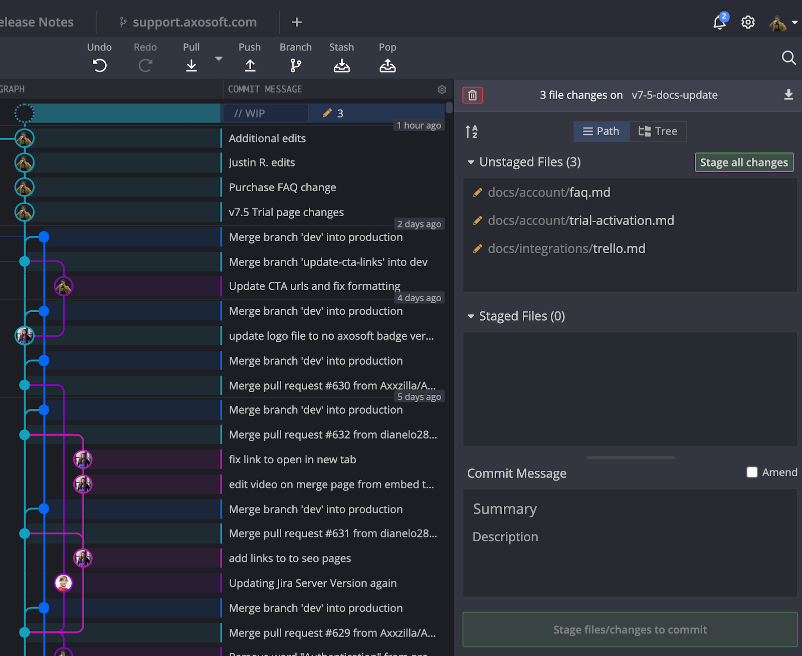

One of my favorite features of Git is [Git hooks](https://git-scm.com/book/en/v2/Customizing-Git-Git-Hooks) because they can let you check different things in your code such as linting, compiling, and testing before any Git action in your repository.

In my ideal project setup, I always set some sort of pre-commit Git hooks to run before committing to the repository, because I do not have failing tests, wrong code listing, or build errors while my code is deployed on Git.

Of course, as a user of GitKraken Client, I want to fire them through the software and know if I can commit something or not.

## Git hooks: What are They?

They are a way to fire off custom scripts when certain actions occur. We have two different groups of Git hooks: client-side and server-side. Client-side Git hooks are triggered by operations like committing and merging, while server-side Git hooks run on network operations such as push.

The following video explains the basics of Git hooks.

<iframe width="560" height="315" src="https://www.youtube.com/embed/ZZgyILr-TjA" title="YouTube video player" frameborder="0" allow="accelerometer; autoplay; clipboard-write; encrypted-media; gyroscope; picture-in-picture" allowfullscreen></iframe>

## What is GitKraken Client?



I think of GitKraken Client as a lifesaver in my software engineer career. For they do not know what it is, is a famous and fantastic Git GUI to perform several actions over Git.

I use it in combination with the Git CLI because it simplifies various actions such as switching through Git profiles, viewing history, complex Git operations like rebase and conflict resolver, and so on.

If you want you can take a try for free by using my [referral link](https://gitkraken.link/davideimola).

## Husky Configuration

The Husky configuration is pretty simple to achieve, first of all, it requires the installation of the husky package by executing in your terminal.

```bash
# NPM
npm install husky -D
# YARN
yarn add -D husky
```

After this thing, we have to add a simple script in our `package.json` like the following.

```diff
{
	"name": "my-package",
	"scripts": {
+		"prepare": "husky install"
	}
}
```

And after that run the following script for installing all the required Husky dependencies.

```bash
# NPM
npm run prepare
# YARN
yarn run prepare
```

After preparing the project with Husky we can add a new simple hook by running the following commands.

```bash
npx husky add .husky/pre-commit "npm test"
```

This will add a new pre-commit Git hook that runs all the tests after the Git commit request.

## Configuring GitKraken Client

GitKraken Client does not need any particular configurations after the release of the [v7.7.2](https://support.gitkraken.com/release-notes/7x/#version-772), where they added the support for `cors.hooksPath` supported by Husky too since version 5, but if you are using an old version considering updating it or viewing this [solution](https://github.com/typicode/husky/issues/875), it might help you.

## GitKraken Client and Husky NVM issue

While using my current workflow I have encountered a problem within GitKraken Client and Node Version Manager. I have discovered GitKraken Client can not execute my Git hooks and I have found in the GitKraken Client logs that `npx` does not exist in PATH.

Node version manager work by modifying the PATH when the terminal is started. For this reason, GUI clients usually do not work well whit those managers as they are not sourcing `.zshrc` or `.bashrc` files where nvm is initialized.

The solution is to create an `.huskyrc` with the following content.

```bash
# ~/.huskyrc
export NVM_DIR="$HOME/.nvm"
[ -s "$NVM_DIR/nvm.sh" ] && \. "$NVM_DIR/nvm.sh"
```

## Conclusions

I hope this post can help everyone interested in git hooks to implement interesting automation within their git workflow to achieve better results on their code.

Finally, I can say I have fixed my hook workflow and I have learned something new about Git and NVM, useful things for my future career.
